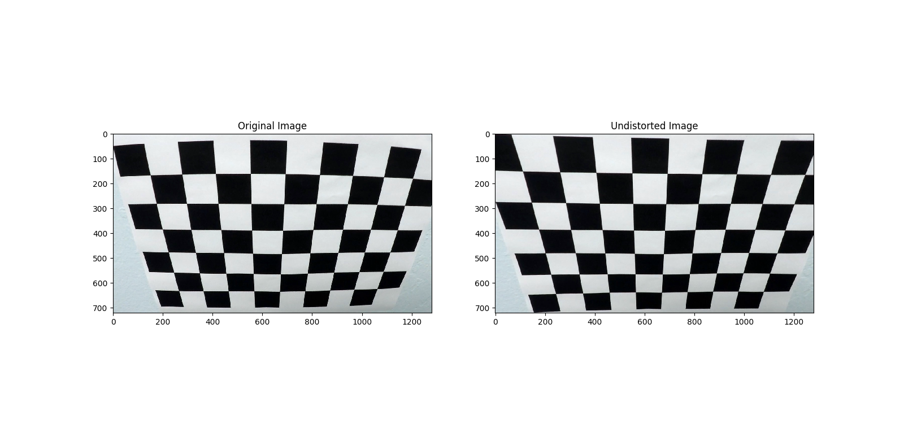
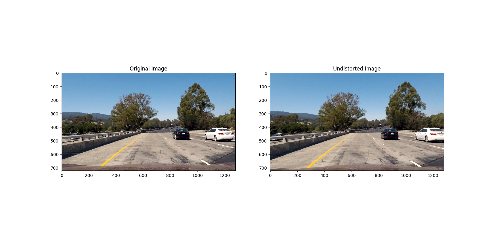
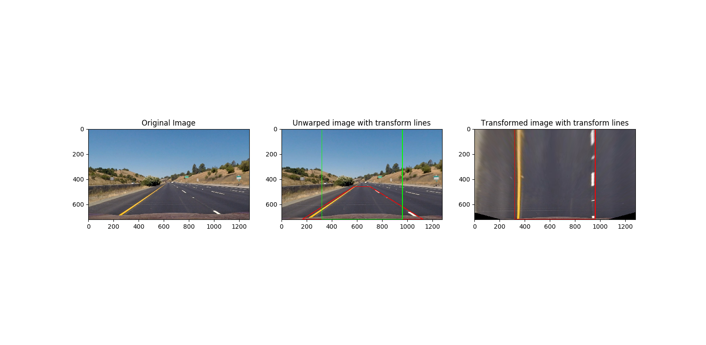
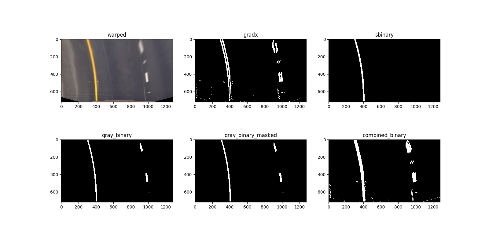
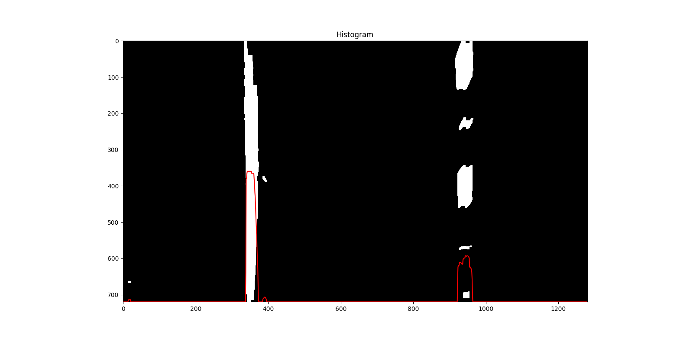
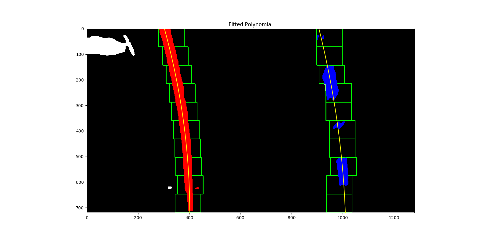
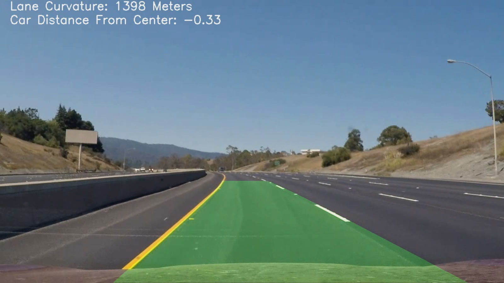

- [Udacity SDC Project 4 - Advanced Lane Finding](#)
  - [Camera calibration](#camera-calibration)
  - [Pipeline](#pipeline)
    - [Distortion-corrected frame](#distortion-corrected-frame)
    - [Perspective Transform](#perspective-transform)
    - [Binary Thresholding](#binary-thresholding)
    - [Polynomial Fitting](#polynomial-fitting)
    - [Radius of Curvature / Vehicle Position](#radius-of-curvature--vehicle-position)
    - [Transform Back To Camera Perspective](#transform-back-to-camera-perspective)
  - [Video Output](#video-output)
  - [Discussion](#discussion)


#Udacity SDC Project 4 - Advanced Lane Finding

In this project for Udacity's Self-Driving Car Nanodegree, an image processing pipeline was implemented in python to find lanes for highway driving. Given for the project was a video of highway driving from the perspective of a forward facing camera centered on the vehicle. Additionally, checkerboard images taken with the same camera were provided for camera calibration purposes.

The goals / steps of the project were the following:
* Compute the camera calibration matrix and distortion coefficients given a set of chessboard images.
* Apply a distortion correction to raw images.
* Use color transforms, gradients, etc., to create a thresholded binary image.
* Apply a perspective transform to rectify binary image ("birds-eye view").
* Detect lane pixels and fit polynomials to find the lane boundaries.
* Determine the curvature of the lane and vehicle position with respect to center.
* Warp the detected lane boundaries back onto the original image.
* Output visual display of the lane boundaries and numerical estimation of lane curvature and vehicle position.

##Camera Calibration
Camera calibration was achieved by utilizing the checkerboard images provided by Udacity along with OpenCV's calibrateCamera() function.

The calibration algorithm works by first computing "image points" and "object points" of the checkerboard corners, where object points represent actual dimensions of the checkerboard and image points represent the pixel positions of the checkerboard in the image plane.

This data is computed for a series of images from different camera perspectives, and passed into cv2.calibrateCamera() to find the camera calibration and distortion coefficients. These parameters can then be used with cv2.undistort to undistort and image.

This calibration only needs to happen once at the beginning of the image processing pipeline. The code can be found in calibration.py. Below is one example of an undistorted checkerboard image.



##Pipeline
An image processing pipeline was implemented to process each frame of the provided video. The top-level pipeline implementation can be found in main.py. Each step in the pipeline will be described below.

###Distortion-corrected Frame
Each frame in the video must first be corrected for camera distortion using the calibration and distortion coefficients previously calculated. Below is an example of an undistorted test image:



###Perspective Transform
After the image has been corrected for camera distortion, it is transformed to a birds-eye view perspective. This is achieved by mapping pixel coordinates in the real space to pixel coordinates in the image plane. Pixel coordinates were chosen based on image size:

```python
#points in the real space
src = np.float32([[(img_size[0] / 2) - 65, img_size[1] / 2 + 100],
                  [((img_size[0] / 6) - 50), img_size[1]],
                  [(img_size[0] * 5 / 6) + 60, img_size[1]],
                  [(img_size[0] / 2 + 65), img_size[1] / 2 + 100]])

#points on the image plane
dst = np.float32([[(img_size[0] / 4), 0],
                  [(img_size[0] / 4), img_size[1]],
                  [(img_size[0] * 3 / 4), img_size[1]],
                  [(img_size[0] * 3 / 4), 0]])
```
OpenCV's `getPerspectiveTransform` and `warpPerspective` functions make calculating the perspective transformation matrices and transforming and image very simple. This code can be found in transform.py. Below is an example of a transformed image, in which the red lines represent the coordinates in the real space, and the green lines represent the coordinates in the image plane:



###Binary Thresholding
After perspective transformation to a birds-eye view, the image was processed to identify lane lines. A combination of gradient thresholding and color thresholding was implemented to produce a binary image in which the lane lines were obvious.

In particular, I made use of a sobel operator in the x direction, a threshold on the "S" layer of the image after converting to HLS color space, and a threshold on the gray-scaled image. Additionally, OpenCV's morphology functions were utilized to clean up some of the noise produces from thresholding. The thresholding pipeline can be found in the `thresh_pipeline()` function in the imageProcessing.py file.

Below are subplots showing the thresholding process:


###Polynomial Fitting
After binary processing has been performed to make lane lines clear, a polynomial was fitted to each lane line. This is achieved by using a sliding window approach as presented in the Udacity lectures. First, a histogram of the binary image is generated:



The histogram information is utilized to find max peaks on the left and right side of the image with respect to the camera center. These peaks represent the start of the left and right lane lines at the bottom of the image. The location of these peaks are used as the start of the sliding window search algorithm.

The sliding window algorithm produces pixel locations of left and right lane lines that can be used in numpy's polyfit() function to produce a polynomial that accurately represents the lane lines. Because of the nature of the problem, after a polynomial has been found, the next frame does not need the full sliding window search as the algorithm should have a starting point that matches the ending point for the previous frame.

In order to smooth the transitions between frames, the polynomial is computed from an average of the previous 15 polynomials. To make this easier to compute, lane line information is stored in a `Line()` object from Line.py. Polynomial fitting and the sliding window approach can be found in lineFinder.py.

Below is an image showing the sliding window approach and fitted polynomials:



###Radius of Curvature / Vehicle Position
Next, the radius of curvature and vehicle position with respect to center is calculated from the fitted polynomials. This is done simply with the following functions:

```python
def get_curvature(lefty, leftx, righty, rightx):
    ym_per_pix = 30/720
    xm_per_pix = 3.7/700
    y_eval = np.max(lefty)
    #Fit polynomials in world space
    left_fit = np.polyfit(lefty*ym_per_pix, leftx*xm_per_pix, 2)
    right_fit = np.polyfit(righty*ym_per_pix, rightx*xm_per_pix, 2)

    #Calculate radii of curvature
    left_curve_rad = ((1 + (2 * left_fit[0] * y_eval * ym_per_pix + left_fit[1])**2)**1.5) / np.absolute(2 * left_fit[0])
    right_curve_rad = ((1 + (2 * right_fit[0] * y_eval * ym_per_pix + right_fit[1])**2)**1.5) / np.absolute(2 * right_fit[0])
    curvature = (left_curve_rad + right_curve_rad)/2
    return curvature

def getCarCenter(left_line, right_line, warped):
    xm_per_pix = 3.7/700
    l_base = left_line.current_fit[0]*warped.shape[0]**2 + left_line.current_fit[1]*warped.shape[0] + left_line.current_fit[2]
    r_base = right_line.current_fit[0]*warped.shape[0]**2 + right_line.current_fit[1]*warped.shape[0] + right_line.current_fit[2]
    car_center = (warped.shape[1]/2 - (l_base + r_base)/2)*xm_per_pix
    return car_center
```

These functions can be found in lineFinder.py.

###Transform Back To Camera Perspective
At this point, we have all the necessary information to project lane lines back onto the original image. This is achieved by using the same `cv2.warpPerspective()` function with the inverse transformation matrix. `cv2.addWeighted()` is utilized to combine a transparent green lane mask with the original image. The previously calculated lane curvature and position with respect to center is displayed in the top left of the image.

Below is an example of the transform back to camera perspective with a transparent lane:



##Video Output
The entire video was run through the lane line finding pipeline, and the output was saved.

[Here is a link to my video result](output.avi)

##Discussion
In this project a system was implemented in python that heavily utilized OpenCV to identify lane lines in a given image, and for each frame in a video. While my implementation was successful, it is easy to pick out potential areas of failure if it was used in different driving scenarios.

For example, one potential area of failure could be a sharp curve in the road. As my implementation only uses the average of previous polynomials to produce the next polynomial, it might have trouble calculating a sharper curve. The averaged polynomial essentially smooths the polynomial from frame to frame and makes it more resistant to drastic change.

Another potential are of failure could be driving scenarios in different lighting conditions. While I was able to account for the brighter and darker areas in the project video, I have not tested the thresholding pipeline on images with extreme lighting conditions or images that have lens flare.

A third potential area of failure arises from the change in road angle. The perspective-transformation algorithm implemented in this project works under the assumption that the road is relatively flat. If the road has any angle, or any bumps, the perspective-transformation becomes unreliable.

In future implementations the lane finding pipeline could be improved in a variety of ways. Sanity checks on the generated polynomial could be introduced to guarantee that the current frame is not producing erroneous results. Such sanity checks could include considering the change in radius of curvature and starting location of the polynomial, or checking concentricity of the lane lines. If the sanity check is violated, it would be possible to ignore the frame in question and persist the existing lane lines. However, if too many consecutive frames are ignored, a full sliding window search from scratch will be necessary.
